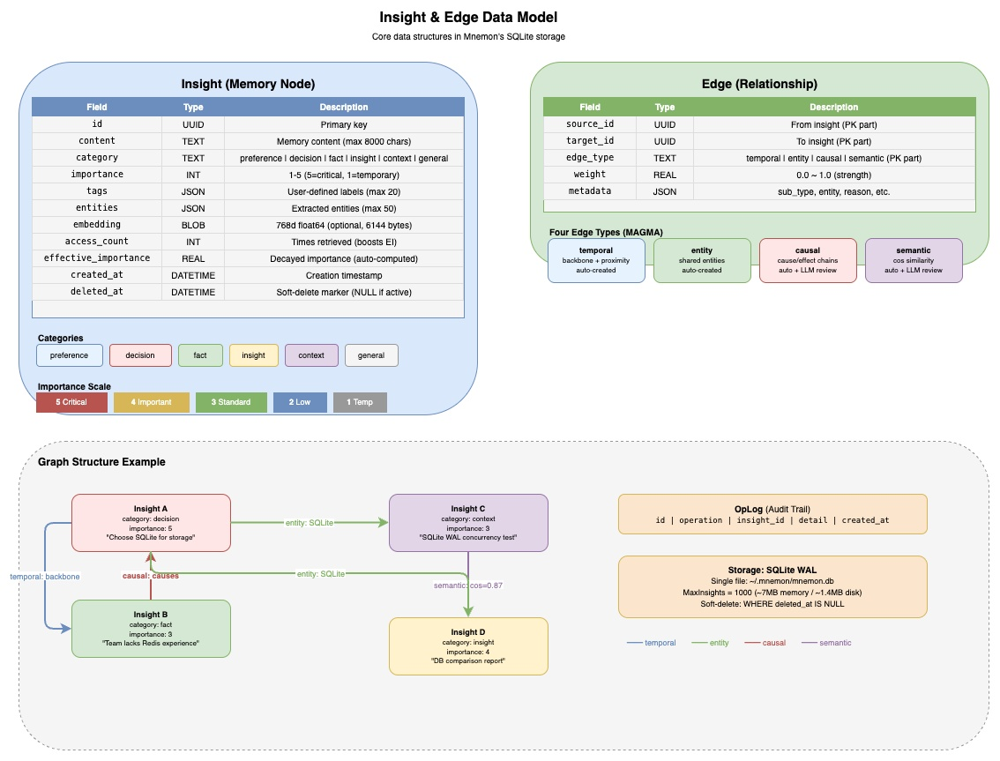

# 3. Core Concepts & Architecture

[< Back to Design Overview](../DESIGN.md)

---



## 3.1 Insight (Memory Node)

An Insight is the fundamental memory unit in Mnemon. Each insight represents an independent piece of knowledge:

```
┌─────────────────────────────────────────────┐
│ Insight                                     │
├─────────────────────────────────────────────┤
│ id         : UUID                           │
│ content    : "Chose Qdrant over Milvus..."  │
│ category   : decision                       │
│ importance : 5  (1-5)                       │
│ tags       : ["vector-db", "architecture"]  │
│ entities   : ["Qdrant", "Milvus"]           │
│ source     : "user"                         │
│ access_count        : 3                     │
│ effective_importance : 0.85                  │
│ created_at : 2026-02-18T10:00:00Z           │
└─────────────────────────────────────────────┘
```

**Categories** are divided into six types that help distinguish the nature of a memory:

| Category | Meaning | Example |
|----------|---------|---------|
| `preference` | User preference | "Prefers communicating in Chinese" |
| `decision` | Architectural/technical decision | "Chose SQLite over PostgreSQL" |
| `fact` | Objective fact | "API rate limit is 100 req/s" |
| `insight` | Reasoning conclusion | "Beam search is more suitable than full BFS for..." |
| `context` | Project context | "Phase 3 completed, 118 tests passing" |
| `general` | General | Content that doesn't fit the above categories |

**Importance** ranges from 1 to 5 and affects retrieval ranking and lifecycle:

- **5**: Critical decision, never automatically cleaned up
- **4**: Important fact, immune to auto-pruning
- **3**: Standard memory
- **2**: Low priority
- **1**: Temporary information, first to be cleaned up

## 3.2 Edge (Relationship)

An Edge connects two insights, representing their relationship. Each edge contains:

```
┌────────────────────────────────────────────┐
│ Edge                                       │
├────────────────────────────────────────────┤
│ source_id  : UUID  ──→  target_id : UUID   │
│ edge_type  : temporal | semantic |         │
│              causal   | entity             │
│ weight     : 0.0 ~ 1.0                    │
│ metadata   : {"sub_type": "backbone", ...} │
└────────────────────────────────────────────┘
```

The four edge types form the foundation of the MAGMA four-graph model, detailed in [Graph Model & Theory](04-graph-model.md).

## 3.3 Database Schema

Each named store has its own SQLite file under `~/.mnemon/data/<store>/mnemon.db`, using WAL mode to support concurrent reads. The default store is `default`; additional stores can be created for data isolation (see [Store Management](../USAGE.md#store-management)).

```sql
-- Memory nodes
insights (
  id, content, category, importance,
  tags, entities, source,
  embedding,                    -- Optional, 768-dim vector
  access_count, last_accessed_at,
  effective_importance,          -- Decayed effective importance
  created_at, updated_at, deleted_at
)

-- Relationship edges (composite primary key)
edges (
  source_id, target_id, edge_type,  -- PK
  weight, metadata, created_at
)

-- Operation log (audit trail)
oplog (
  id, operation, insight_id, detail, created_at
)
```

---

## 3.4 System Architecture

Mnemon ships one executable that composes two deliberately separate product
paths. Memory remains available through root commands; Agency is available only
under `mnemon agency ...`. Sharing the executable does not merge their state or
authority.

```
                         mnemon
                            |
              +-------------+-------------+
              |                           |
       root Memory commands        mnemon agency ...
              |                           |
  model / graph / search / store    View / Intent / admission
  embed / import / setup assets     Artifact / peer / attachment
              |                           |
       named Memory stores          project .mnemon/agency
```

The Memory path owns knowledge storage and retrieval. The Agency path owns
durable responsibility and admitted effects for an existing Agent Runtime. Its
normative object and package boundaries are documented in the
[mnemond protocol](../mnemond/protocol.md).

**Project code structure:**

```
mnemon/
├── main.go                    # Process entry point
├── cmd/
│   ├── root.go                # Compose the single product command
│   ├── memory/                # Root Memory commands and Memory flags
│   └── agency/                # `mnemon agency` user commands
├── internal/
│   ├── model/                 # Memory Insight and Edge values
│   ├── graph/                 # Four-graph edge construction and traversal
│   ├── search/                # Recall, intent detection, and deduplication
│   ├── embed/                 # Optional Ollama embeddings
│   ├── importdraft/           # Memory draft validation and import
│   ├── store/                 # Memory SQLite persistence
│   ├── setup/                 # Memory runtime integration and embedded assets
│   ├── agency/                # Immutable Agency protocol values and projections
│   ├── authority/             # View sealing, Intent admission, durable fact writer
│   ├── artifact/              # Content-addressed immutable evidence
│   ├── peerlink/              # Replaceable authenticated peer transport
│   ├── daemon/                # Local authority process composition and lifecycle
│   ├── agencyclient/          # Runtime-facing terminal and replay journal
│   └── attach/                # Agency Hook, guide, and tool projection
├── test/mnemond/              # Agency boundary and scenario suites
├── testdata/mnemond/          # Data-only Agency fixtures
└── scripts/e2e_test.sh        # Memory CLI end-to-end suite
```

## 3.5 Memory Data Directory Layout

The following user-wide layout belongs only to Memory. Agency keeps its
independent project-local state under `<project>/.mnemon/agency/`.

```
~/.mnemon/
├── active                        # Current default store name (plain text)
├── prompt/                       # Shared across all stores
│   ├── guide.md                  # Behavioral guide (recall/remember rules)
│   └── skill.md                  # Skill definition (command reference)
└── data/                         # Each store has its own isolated directory
    ├── default/
    │   └── mnemon.db             # SQLite database (WAL mode)
    ├── work/
    │   └── mnemon.db
    └── <name>/
        └── mnemon.db
```

**Isolation boundary**: Each store contains an independent `mnemon.db` — insights, edges, and oplog are fully isolated. Prompt files (`guide.md`, `skill.md`) are shared — behavioral rules are universal, memory data is private.

## 3.6 Memory Store Isolation

Mnemon supports named stores for lightweight data isolation between different agents, projects, or scenarios.

**Why named stores instead of just `--data-dir`?**

`--data-dir` overrides the entire base directory — a blunt instrument that requires the caller to manage full paths. Named stores provide semantic clarity (`MNEMON_STORE=work` vs `--data-dir ~/.mnemon-work`) and work naturally with environment variables, which are the standard isolation mechanism for concurrent processes.

**Resolution priority** (highest to lowest):

```
--store flag  >  MNEMON_STORE env  >  ~/.mnemon/active file  >  "default"
```

This layered design serves different scenarios:

| Mechanism | Scenario |
|-----------|----------|
| `--store` flag | One-off CLI override, scripting |
| `MNEMON_STORE` env | Per-process isolation — different agents use different stores |
| `active` file | Persistent user preference — `mnemon store set work` |
| `"default"` | Zero-config — works out of the box |

**Automatic migration**: When the new `data/` directory doesn't exist but a legacy `~/.mnemon/mnemon.db` does, mnemon automatically moves it to `data/default/mnemon.db`. Users upgrading from older versions experience a seamless transition.

**Design principle — lightweight and bounded**: Store isolation addresses a necessary data separation concern without growing into a multi-tenant system. There are no access controls, no cross-store queries, no store metadata beyond the name. This keeps the feature bounded — Mnemon is a memory daemon, not a knowledge base platform.
