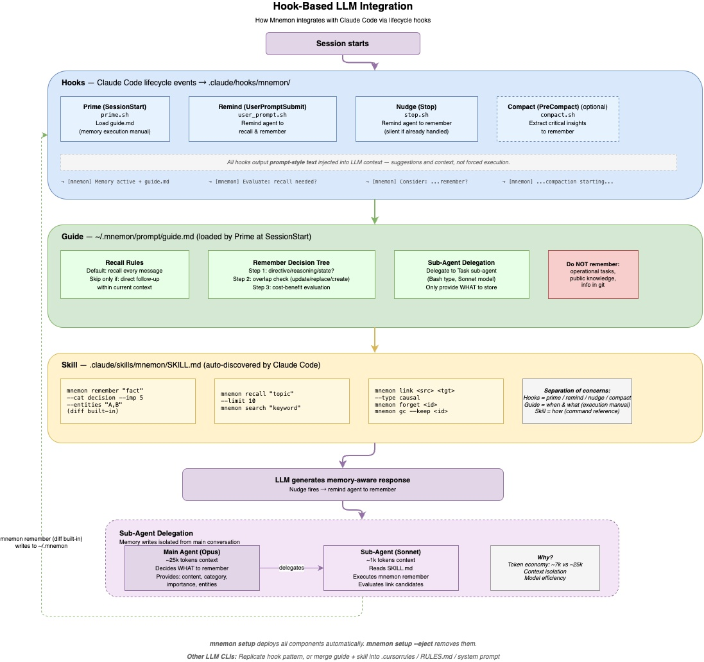

[< 返回设计概览](../DESIGN.md)

# 7. LLM CLI 集成



Mnemon 通过小型的 runtime 原生投影集成到 LLM CLI，而不是成为某个
runtime-specific agent framework。目标 runtime 继续负责对话、规划、文件编辑、
工具调用和语义判断。Mnemon 提供持久记忆协议、skill 能力面、共享 guide，并在
runtime 支持的位置提供轻量生命周期提醒。

集成层遵循 **Hook-native, LLM-led, Protocol-constrained** 原则：

- **Hook-native**：生命周期事件是提醒 agent 使用记忆的好位置，但 hook 应保持轻量。
- **LLM-led**：宿主 agent 判断 recall 或 writeback 是否有用。
- **Protocol-constrained**：Mnemon 负责确定性命令、结构化输出、provenance、link、去重和生命周期操作。

## 7.1 已安装投影

当前集成把同一套共享行为模型投影到各 runtime 最接近的原生表面：

| 资产 | 职责 |
|---|---|
| 各 runtime 的 `SKILL.md` | 教命令语法、输出解释和硬性 guardrail |
| `<prompt-dir>/guide.md` | 提供共享的 recall、writeback、link 与 no-op 判断指引；默认 prompt 目录是 `~/.mnemon/prompt/` |
| 原生 hook 或 extension | 在 runtime 暴露的生命周期点提供有界提醒 |
| `mnemon` binary | 执行确定性记忆操作 |

`mnemon setup` 为已知 runtime 安装这些资产。路径和 hook 形态只是集成细节：
runtime 可以使用 shell hook、plugin、TypeScript extension、持久指令，或只使用
skill。这些表面都不拥有 Memory 状态。

## 7.2 四个 Hook Phase

四个 hook phase 定义生命周期契约：

```text
Session starts
    |
    v
  Prime   -> 加载 skill/guide 立场和当前 store 信息
    |
    v
User prompt arrives
    |
    v
  Remind  -> 询问 recall 是否可能改变当前任务
    |
    v
Agent 仅在有用时使用 Mnemon
    |
    v
  Nudge   -> 询问 durable writeback 是否有正当性
    |
    v
Before context compaction
    |
    v
  Compact -> 只保存关键连续性
```

Hook 契约是行为契约。脚本正文是 runtime-specific implementation detail。

| Phase | 典型事件 | 必须行为 | 应避免 |
|---|---|---|---|
| Prime | Session start / bootstrap | 让 Mnemon skill、guide 和当前 store 可见 | 批量注入历史 memory |
| Remind | User prompt submit / before planning | 对记忆敏感任务触发 recall 判断 | 每个 prompt 自动 recall |
| Nudge | Stop / after response | 对 durable insight 触发 writeback 判断 | 保存普通聊天日志 |
| Compact | Before compaction | 在上下文丢失前保存关键连续性 | 保存完整 transcript |

当 runtime 没有 hook 时，把同样检查编码成持久规则。agent 可以在任务开始、任务结束和压缩边界自检。

## 7.3 Runtime 映射

同一个集成契约在不同 runtime 中有不同安装方式：

| Runtime | 自然安装机制 |
|---|---|
| Codex | `AGENTS.md`、skill、本地指令，以及启用后的 hooks |
| Claude Code | `CLAUDE.md`、skill、slash command、settings hooks、project/user memory 文件 |
| OpenClaw | Plugin hooks 和 skill，但不要求 Mnemon-specific memory engine |
| Pi | `AGENTS.md`、原生 skill，以及 TypeScript extension lifecycle events |
| Skill-first agents | Skill、memory guidance 和轻量提醒 |
| Minimal CLIs | 承载相同有界指引的 skill、rules 文件或 system instruction |

这些映射位于各 runtime 的 setup 代码和内嵌资产中，不是独立的产品架构。

## 7.4 Agent 主导的记忆工作

Agent 应把 memory 当成判断，而不是反射动作：

1. 任务开始时，判断过往经验是否可能改变当前工作。
2. 如果是，运行聚焦的 `mnemon recall` 查询，并把结果当作证据。
3. 执行任务时，当前用户指令和仓库事实优先于陈旧 memory。
4. 任务结束时，判断本 session 是否产生 durable knowledge。
5. 如果是，写入简洁且带 provenance 的 memory，并在关系有用时 link 或 supersede。
6. 如果不是，什么都不做。

当 runtime 支持 sub-agent 时，委派可能有用，尤其适合昂贵的 writeback review 或长 session。它是执行策略，不是架构必需品。单个 capable agent 也可以直接完成同样的记忆判断。

## 7.5 Markdown 自进化

集成层应主要通过经过 review 的 Markdown patch 演化：

```text
repeated experience
  -> Mnemon recall/writeback evidence
  -> LLM reflection
  -> candidate patch to SKILL.md / guide.md / project rule
  -> review
  -> installed behavior
```

这种方式让自进化可检查、可回滚。稳定 workflow 进入 skill，稳定判断变化进入
guide。Runtime setup 的变化仍作为普通代码或内嵌资产接受 review。代码、数据库
schema 或 runtime 内核只有在 Markdown loop 证明行为有价值后再演化。

## 7.6 验证

当目标 agent 能做到以下事情时，集成可接受：

1. 找到 Mnemon skill，并解释命令语法。
2. 找到 memory guide，并解释 recall/writeback 的跳过条件。
3. 针对记忆相关任务运行 `mnemon recall`。
4. 写入一条带 provenance 的 durable memory。
5. 对 trivial task 跳过 memory。
6. 当 runtime 暴露压缩生命周期点时，只在压缩前保存关键连续性。

如果 hook 强制每个 prompt 使用 memory、memory 变成 transcript dump，或陈旧 memory 覆盖当前用户指令和仓库证据，则集成失败。
