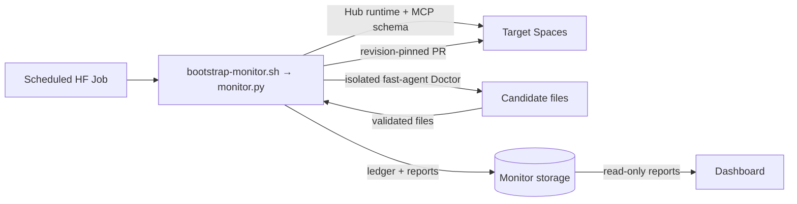

# Space Monitor Architecture

The scheduled monitor reads a CSV catalog every eight hours, observes every Space, and takes one repair step at most
for each failing revision. Operational configuration is in [`monitor/README.md`](../monitor/README.md).



## Loop

1. `monitor.py` uses Python's CSV parser, so ordinary quoted CSV fields and empty fields do not corrupt Space IDs.
   It checks Hub runtime state and a runnable Space's Gradio MCP schema with bounded retries.
2. Healthy and degraded Spaces are recorded without mutation. Unhealthy Spaces consult the ledger:
   - a new `PAUSED` or `RUNTIME_ERROR` revision gets one normal, non-factory restart;
   - after a restart, or for other unhealthy states, the Doctor diagnoses the exact revision and may prepare a PR;
   - a `pr-opened`, `pr-failed`, or `needs-human` entry holds until the revision changes.
3. One redacted report includes all observations and any treatment result.

## State

```text
monitor/
├── reports/YYYY/MM/DD/<run-id>/{report.json, COMPLETE}
└── state/ledger/<space-key>.json
```

The ledger is written before a restart or PR. Each local ledger update is written, fsynced, and atomically renamed.
The scheduled Job uses `--no-concurrency`. Report consumers ignore a directory until `COMPLETE` exists.

## Authority boundary

| Actor | Credentials | May do |
| --- | --- | --- |
| Doctor child | model key, optional read-only Hub token | read, diagnose, write local candidate files |
| Parent | `HF_TOKEN` (or `DEFAULT_HF_TOKEN` fallback) | health reads, restart, create PR |

The optional `MONITOR_HF_TOKEN` is passed only to the Doctor as its read-only `HF_TOKEN`; the parent credential is
never injected into the Doctor environment. When repair execution uses the parent Hub credential, the parent must run
as root and launches the Doctor as a separate UID with a minimal environment. `monitor.py --check` remains read-only
and works non-root with the parent credential. The parent validates candidate files (repository-relative paths, no
symlink traversal, size limits, credential scan) before creating a PR with `parent_commit` equal to the diagnosed
revision. A changed upstream revision therefore rejects the stale PR rather than applying it.
